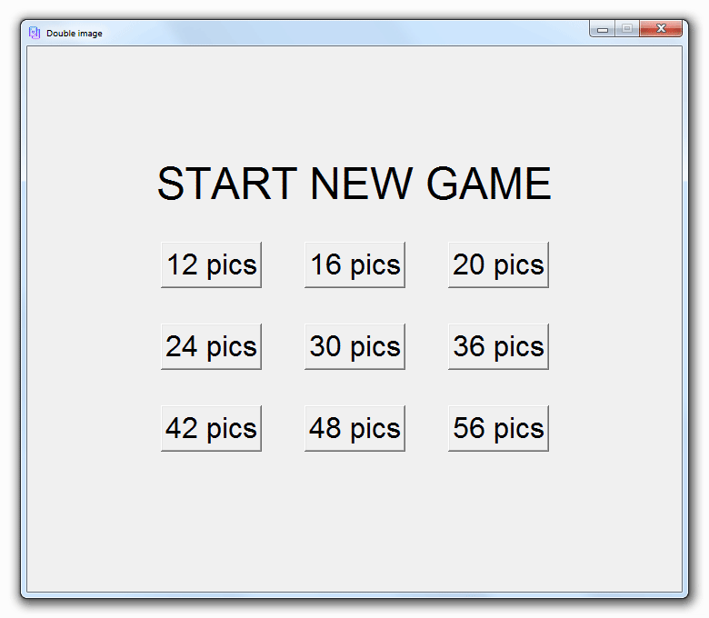

# Mini game "Doubl image"

At the beginning of the game, all cards are closed. The player opens one card at a time. If the images are the same, the cards disappear. The game continues until all the cards are gone. The game has 9 levels - from 12 to 56 cards.

To play the game download "Doubl image.exe", "icon_di.ico", "images" folder.

All images are taken from [Icons8](https://icons8.com/).

The game is designed not for commercial usage.
